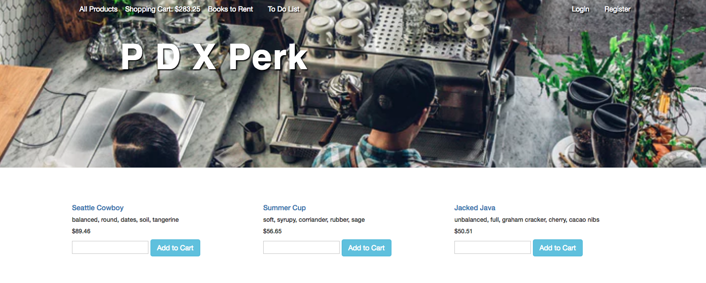

# PDX Perk

#### _By Kaila Goff & Maggie Summers_

#### _An e-commerce site for a fictitious coffee shop._

<kbd></kbd>

## Description

_An e-commerce site for a fictitious coffee shop. Users can visit a web store with products pre-populated from a database. They can also see books that the coffee shops has available to rent, utilizing the NYT API. Finally, users can use a virtual to-do list, to accomplish their tasks while enjoying their coffee. 4-31-18_


##### Seeding
_This website includes seed data for 12 coffee products, using Faker with a loop to seed the database._

## Install the DATABASE instructions

* _Enter into the terminal:_ ``` $bundle install```

* _In the following line enter:_ ```$rake db:create```

* _In the following line enter:_ ```$rake db:migrate```

* _In the following line enter:_ ```$rake db:test:prepare```

* _In the following line enter:_ ```$rake db:seed```

## Setup/Installation Requirements

  * _Enter in the terminal:_ ``` $rails server```

  * _Using a web browser, type in the url_ ``` localhost:3000 ```

## Known Bugs

  * _No known bugs at this time._

## Support and contact details

  _To suggest changes, submit a pull request in the GitHub repository._

## Technologies Used

  * Ruby
  * Rails
  * pSQL
  * ActiveRecord

### License

  *MIT License*

Copyright (c) 2018 **_Kaila Goff & Maggie Summers_**
